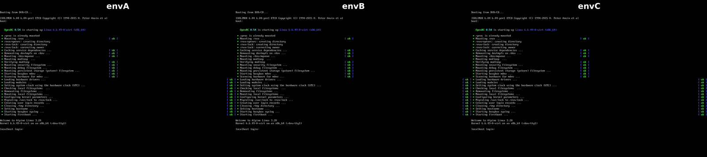
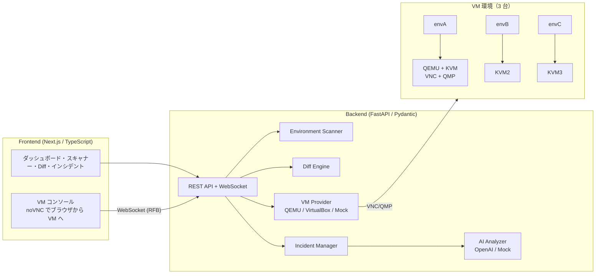

# DevMirror

**環境の差異を可視化し、障害を再現可能なインシデントへ変換するエンジニアリングプラットフォーム**

```
Environment → Diff → Reproduce → Evidence → Diagnose → Save → Replay
```

DevMirror は仮想化、CI/CD、ブラウザテスト、オブザーバビリティ基盤の**置き換えではありません**。  
環境情報・再現手順・インシデント証拠を一つのワークフローに接続します。

> DevMirror は「AI がバグを直すツール」ではありません。  
> 環境問題と再現困難な障害を、観測可能・再現可能・分析可能にします。



---

## 全体像



---

## 問題

**「私の環境では動く。」**

- 環境 A では動く C++ プロジェクトが、環境 B では起動しない
- ローカルでは成功するテストが CI で失敗する
- 顧客環境でのみ再現する不具合
- 過去のインシデントを同じ条件でやり直せない

最初の公式デモは **C++ + DX Library** です。アーキテクチャは DX Library に固定しません。

---

## 解決

共通モデルでつなぎます。

| 概念 | 役割 |
| --- | --- |
| Environment Fingerprint | 安全に収集した環境のスナップショット |
| Environment Diff | MATCH / CHANGED / MISSING / ADDED / UNKNOWN |
| Incident Capsule | 再現可能な障害の証拠一式 |
| Incident Replay | 保存済みカプセルからの再実行と比較 |
| AI Diagnosis | 証拠・差異・仮説・調査提案を分離 |

差異を自動的に **Root Cause** とは呼びません。証拠が足りない場合は **関連しうる差異** と表示します。

---

## アーキテクチャ

```
Frontend (Next.js / TypeScript / Tailwind)
        ↓
Backend (FastAPI / Pydantic)
        ↓
Application Services
├── Environment Scanner
├── Fingerprint
├── Diff Engine
├── Incident Manager
├── Test Engine (CommandTestRunner)
├── VM Provider (MockVMProvider / QemuProvider / VirtualBoxProvider)
├── Evidence Collector
├── AI Analyzer (OpenAI または Mock)
└── Git Integration (MockGitHubClient)
        ↓
SQLite（将来 PostgreSQL）
```

詳細は [docs/ARCHITECTURE.md](docs/ARCHITECTURE.md) を参照してください。

---

## 機能（MVP）

実装済み:

- ダッシュボード
- 環境スキャナー
- Environment Fingerprint v1
- Environment Diff
- Incident Capsule
- MockVMProvider による Replay（シミュレーションであり検証済み再現ではない）
- **QemuProvider（WSL + KVM）による実機 VM**
- **ブラウザ内 VM コンソール**（noVNC で 3 環境に入れる・起動/停止/リセット）
- **VM スクリーンショット**（QMP `screendump`）
- VirtualBoxProvider による実機 Replay（3 環境 VM 対応）
- CommandTestRunner
- AI 診断（API キー未設定時は Mock）
- DX Library 公式デモの投入

明示的に未実装:

- DockerProvider（インターフェース準備のみ）
- Playwright 実行マトリクス
- OpenTelemetry / eBPF
- 実 GitHub / GitHub Actions 連携
- ネットワークシミュレーション（tc/netem）

---

## Environment Fingerprint

スキーマバージョン付きの構造化データです。収集対象（取得できる場合）:

OS、版、アーキテクチャ、CPU、メモリ、コンパイラ、MSVC、Visual Studio、Windows SDK、Python / Node / PHP、Git、Docker、CMake、依存関係、プロジェクト、Git commit、サニタイズ済み PATH。

**収集・保存しないもの:**

パスワード、API キー、トークン、秘密鍵、Cookie、その他シークレット。

---

## Environment Diff

2 つの Fingerprint を比較します。

- 状態: `MATCH` `CHANGED` `MISSING` `ADDED` `UNKNOWN`
- 重要度: `LOW` `MEDIUM` `HIGH`
- 高重要度の不一致は **関連しうる差異** とマーク（原因の断定ではない）

---

## Incident Capsule

再現可能な問題の記録です。例:

```
INC-0001
プロジェクト: DXGame
コミット: abc1234
環境: 環境B（失敗する）
結果: FAIL
証拠: DxLib.dll が見つからない
診断: 証拠と仮説を分離（Mock AI）
```

---

## Incident Replay

```
Incident Capsule → 環境再構築 → checkout → 依存関係 → ビルド → テスト → 証拠 → 元データと比較
```

MVP の Replay は **MockVMProvider** です。実プロジェクトを動かしていないため `reproduction_verified: false` を返します。成功したように見せかけることはしません。

---

## AI Diagnosis

返却構造:

- `summary`
- `observed_evidence`（観測された証拠）
- `detected_differences`（検出された差異）
- `hypotheses`（仮説）
- `suggested_investigations`（調査提案）
- `confidence`
- `data_sources_used`

AI はログや版を捏造しません。根拠のない因果は述べません。

---

## Environment Matrix

将来 Playwright で OS × ブラウザの結果を並べます。現状の画面は **未実装の見本** です。BrowserStack のクローンではありません。

---

## 技術スタック

| 層 | 技術 |
| --- | --- |
| Frontend | Next.js, TypeScript, Tailwind CSS |
| Backend | Python, FastAPI, Pydantic |
| DB | SQLite（将来 PostgreSQL） |
| 仮想化 | QEMU + KVM（`VM_PROVIDER=qemu`）、VirtualBox、または Mock |
| テスト | pytest, 将来 Playwright / CTest |
| AI | OpenAI API または Mock |
| 観測 | 将来 OpenTelemetry |

---

## デモ（C++ + DX Library）

1. バックエンドとフロントエンドを起動する
2. ダッシュボードで **「DX Library 公式デモを投入」** を押す
3. `INC-0001` を開く
4. 環境A（DLL あり）と環境B（DLL なし）の Diff を確認する
5. 証拠・仮説・調査提案を確認する
6. Replay を実行し、**シミュレーションであり未検証** と表示されることを確認する
7. **VM コンソール**（`/vm/console`）で envA / envB / envC を起動し、ブラウザの中に入る

物語:

- このプロジェクトは環境Aでは動く
- 環境Bでは失敗する
- DevMirror が差異を検出した
- 証拠が保存された
- AI は証拠の上でのみ仮説を出した
- インシデントを保存し、後から Replay できる
- 3 台の VM がブラウザの中に立ち上がる

---

## 1 分で魅せるデモ

発表や面接で「これは学園祭のアート」に見せないための台本です。

1. **開く**: `/vm/console` を表示し、envA / envB / envC がそろっていることを見せる。
2. **動く**: 「起動」を押すと、数秒で VNC が開き、いつでも実際に操作できることを示す。
3. **差を映す**: `/scanner` で環境スキャン → `/diff` で 3 環境の MATCH / MISSING を表示。
4. **原因を語る**: インシデント詳細の AI Diagnosis を開く（Mock でも返却構造を説明）。
5. **締めの言葉**: 「環境差の証拠を観測可能・再現可能・分析可能にした。VM はブラウザの中で操作できる。」

準備物: バックエンド（WSL）+ フロントエンド（Next.js）+ QEMU の 3 プロセスだけ。

---

## セットアップ

### 必要条件

- Python 3.11+
- Node.js 18+

### バックエンド

```bash
cd backend
python -m venv .venv
.venv\Scripts\activate
pip install -r requirements.txt
copy .env.example .env
uvicorn app.main:app --reload --port 8000
```

API 文書: http://localhost:8000/api/docs

### フロントエンド

```bash
cd frontend
npm install
npm run dev
```

UI: http://localhost:3000

### Docker Compose

```bash
docker-compose up --build
```

---

## ブラウザから VM に入る（QEMU + KVM）

`/vm/console` を開くと、**ブラウザの中の VM に入って操作**できます。
画面をクリックしてキーボードとマウスを使えるので、
VirtualBox のウィンドウを自分で出す必要はありません。

DevMirror 本体は手元のマシンで動き、VM には**ゲームだけ**を入れます。

### なぜ QEMU なのか

| | QEMU + KVM（推奨） | VirtualBox |
|---|---|---|
| ブラウザから入る | **可**（VNC を noVNC で中継） | 不可（VNC を公開できない） |
| 導入 | WSL に入れるだけ | インストーラ + BIOS 設定 |
| 3 環境の作り分け | overlay（差分）なので軽い | クローン |
| 加速 | KVM（ハードウェア） | Hyper-V と衝突しやすい |

### 前提

- WSL2 が使えること
- `/dev/kvm` が存在すること（`ls -l /dev/kvm` で確認）
- 3 台同時起動するので `QEMU_MEMORY_MB × 3` が物理メモリに収まること

### 手順

1. **権限と QEMU を入れる**（1 回だけ。パスワードが要る）

   ```bash
   sudo usermod -aG kvm $USER
   sudo apt install -y qemu-system-x86 qemu-utils
   ```

   `usermod` の後は**ターミナルを開き直す**（グループの変更が反映されるまで）。

2. **基準ディスクと 3 環境を作る**（1 回だけ）

   バックエンドは WSL 上の Python で動かす（`~/.devmirror/venv`）。

   ```bash
   cd backend
   ~/.devmirror/venv/bin/python -m scripts.prepare_qemu --build
   ```

   基準ディスク（`base.qcow2`）と `envA` / `envB` / `envC` の overlay を作る。
   このスクリプトは途中で `backend/.env` に設定する値を表示する（この repo の
   `.env` には既に値が入っている）。

3. **VM を起動する**

   ```bash
   cd backend
   ~/.devmirror/venv/bin/python -m scripts.prepare_qemu --start    # 3 台まとめて起動
   ~/.devmirror/venv/bin/python -m scripts.prepare_qemu --stop     # 停止
   ```

   バックエンド本体は別途 WSL で起動しておく:

   ```bash
   cd backend
   ~/.devmirror/venv/bin/python -m uvicorn app.main:app --host 0.0.0.0 --port 8000
   ```

4. **ブラウザから入る**

   <http://localhost:3000/vm/console>

   3 環境のカードから「起動」を押し、「開く」でコンソールが表示されます。

### API

| メソッド | パス | 用途 |
|---|---|---|
| GET | `/api/v1/vm/console/list` | 3 環境の状態 |
| POST | `/api/v1/vm/console/{name}/create` | overlay を作る |
| POST | `/api/v1/vm/console/{name}/start` | 起動 |
| POST | `/api/v1/vm/console/{name}/stop` | 停止 |
| POST | `/api/v1/vm/console/{name}/reset` | 初期状態に戻す |
| WS | `/api/v1/vm/console/{name}/vnc` | VNC を WebSocket に中継 |

### 注意事項

- `QEMU_ACCEL=kvm` には `/dev/kvm` への権限が必要。無ければ `tcg` になるが**非常に遅い**
- Alpine の ISO は CD から起動するので、ディスクにインストールしなくてよい
  （Windows + DX Library を使う場合は Windows ディスクが必要です）
- ログ取得とスクリーンショットは QMP 経由（`screendump`）
- 3 台を同時に動かすため `QEMU_CPUS` × 3 が物理コア数を超えないこと

---

## 3 つの VM で実機テストする（VirtualBox）

Windows 3 台の代わりに VirtualBox の VM 3 台で環境差分を再現する。
DevMirror 本体は手元のマシンで動き、VM には**ゲームだけ**を入れる。
ブラウザから VM に入りたい場合は、上記の QEMU 経路を使ってください。

### 前提

- VirtualBox がインストール済み（Guest Additions 同梱）
- 基準 VM: Windows + DX Library が入った環境。名前 `DevMirror-Base` で登録
- 基準 VM 内に guestcontrol 用のユーザーを作っておく
- 3 台同時起動するので `VBOX_MEMORY_MB × 3` が物理メモリに収まること

### 手順

1. **基準 VM を作る**（1 回だけ）

   Windows をインストールし、Guest Additions を入れる。
   VirtualBox > 管理 > 設定 > 一般 で名前を `DevMirror-Base` にする。

2. **.env を設定**

   ```bash
   VM_PROVIDER=virtualbox
   VBOX_BASE_VM=DevMirror-Base
   VBOX_GUEST_USERNAME=<VM 内のユーザー名>
   VBOX_GUEST_PASSWORD=<VM 内のパスワード>
   VBOX_PROJECT_PATH=C:\dev\DXGame      # ホスト側のゲームフォルダ
   VBOX_GUEST_PATH=C:\DevMirror\app      # ゲスト側
   VBOX_MEMORY_MB=2048
   VBOX_CPUS=2
   ```

3. **VM を 3 台用意する**

   ```bash
   cd backend
   python -m scripts.provision_vms                       # envA / envB / envC
   python -m scripts.provision_vms --names pc1 pc2 pc3   # 名前を変える場合
   python -m scripts.provision_vms --destroy             # 作り直す場合
   ```

4. **接続を確認**

   ```bash
   curl http://localhost:8000/api/v1/vm/status
   ```

   `available: true` になれば OK。`false` のときは `detail` に理由が出る
   （基準 VM が無い・認証情報が未設定・VBoxManage が見つからない）。

5. **スキャンして比較する**

   `http://localhost:3000/scanner` で各環境をスキャンし、
   `/diff` で 3 環境の違いを確認する。

6. **実機で Replay する**

   インシデント詳細の「インシデントを再実行」を押す。
   VM が 3 台順に立ち上がり、ゲームを配置して実行し、ログを回収する。
   `provider: VirtualBoxProvider` / `simulated: false` /
   `reproduction_verified: true` なら実機での再現が確認できたことになる。

### 注意事項

- 再実行ごとに VM は破棄される。状態を残したい場合は `VBOX_KEEP_VM=true`
- Guest Additions が入っていないと `guestcontrol` が使えない
- `run_command` はゲストの `cmd.exe` に渡される。`incident.command_executed`
  に外部入力をそのまま入れないこと
- 3 台を同時に動かすため `VBOX_CPUS` × 3 が物理コア数を超えないこと

---

## テスト

バックエンド（FastAPI / 各 VM Provider）を **73 本の自動テスト** がカバーしています。
テストは GitHub Actions で継続的に実行され、1 本でも失敗すると CI が失敗します。

[](https://github.com/tanakaseidy3103/devmirror/actions/workflows/tests.yml)

### 実行環境ごとの結果（全て成功）

| 環境 | Python | pytest 結果 |
| --- | --- | --- |
| Windows | 3.11.9 | 73 passed |
| Linux / WSL | 3.12.14 | 73 passed |

### ローカルでの実行

```bash
cd backend
pytest
```

実行例:

```
======================= 73 passed in 8.63s ========================
```

### カバー範囲

| テストファイル | 数 | カバーする領域 |
| --- | --- | --- |
| `tests/test_qemu_provider.py` | 27 | QEMU / KVM Provider（QMP、noVNC、overlay、スクリーンショット、タイムアウト） |
| `tests/test_virtualbox_provider.py` | 21 | VirtualBox Provider（クローン、headless 起動、コマンド実行、ログ、依存導入） |
| `tests/test_vm_console.py` | 9 | ブラウザ VM コンソール（VNC / WebSocket、環境 CRUD、エラーハンドリング） |
| `tests/test_vm_wiring.py` | 9 | VM ファクトリ（Mock / VirtualBox / QEMU）、ステータス判定、Replay API |
| `tests/test_diff_and_sanitize.py` | 4 | 環境差分エンジン、機密情報のサニタイズ |
| `tests/test_api_demo.py` | 2 | デモ API フロー（シード → 差分 → 診断） |
| `tests/test_ai_analyzer.py` | 1 | AI 診断（OpenAI / Mock フォールバック） |
| **合計** | **73** | 全て成功 |

---

## セキュリティ

- コマンドは allowlist / タイムアウト前提（任意コマンドの自由実行はしない）
- 環境変数名からシークレットらしきものを除外
- PATH のユーザー名を伏せる
- Replay の Mock を「実再現成功」と偽らない

---

## スクリーンショット

| 画面 | 状態 |
| --- | --- |
| ダッシュボード | UI 実装済み（実行後に撮影） |
| 環境スキャナー | UI 実装済み |
| 環境 Diff | UI 実装済み |
| インシデント | UI 実装済み |
| Replay | UI 実装済み（Mock） |

`docs/screenshots/` に実機キャプチャを追加してください。

---

## ロードマップ

1. Scanner / Fingerprint / Diff / Capsule（現行 MVP）
2. MockVMProvider / CommandTestRunner
4. DockerProvider
5. Playwright
6. 実 AI Analyzer
7. より厳密な Incident Replay
8. OpenTelemetry
9. GitHub / CI
10. ネットワークシミュレーション
11. eBPF（研究）

---

## 今後の研究

- Linux 上の eBPF による低オーバーヘッド観測
- 類似インシデント検索（RAG）
- ネットワーク劣化（latency / loss）とテスト結果の差分

---

## ライセンス

MIT License
